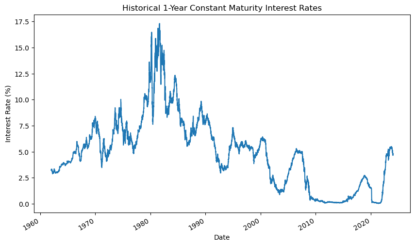
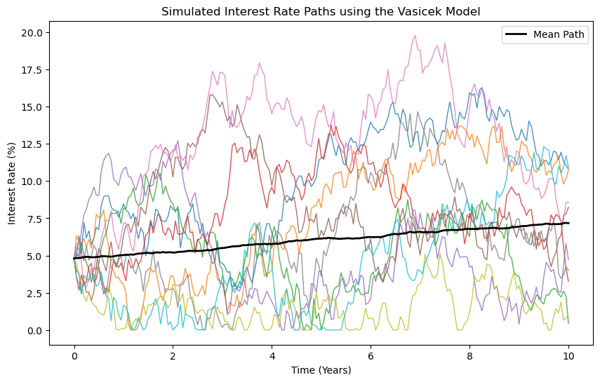
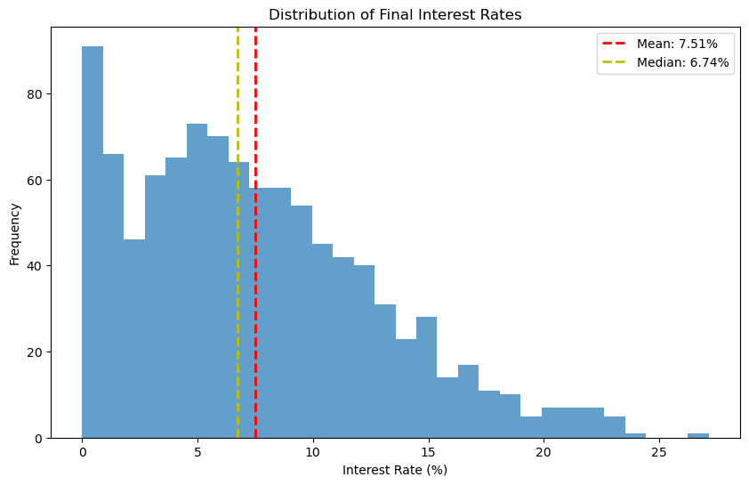
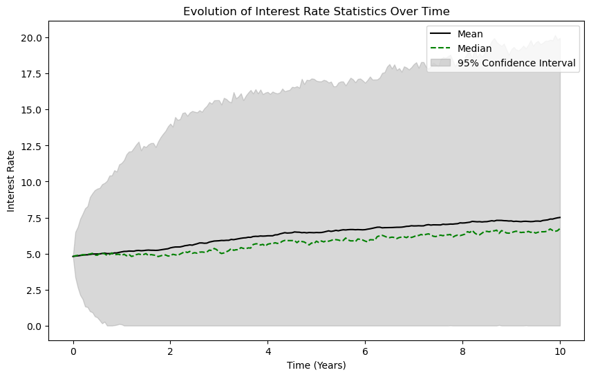

# Interest Rate Prediction using the Vasicek Model

This project demonstrates how to use the Vasicek model to simulate future interest rate paths with a Monte Carlo simulation. The Vasicek model is a mathematical model that describes the evolution of interest rates. It's a type of one-factor short-rate model where the rate of interest at any future time is determined by the level of current interest rates plus some randomness. The model is characterized by mean reversion, indicating that interest rates tend to revert towards a long-term mean value over time.

## Libraries

We'll start by importing the necessary libraries for our simulation.


```python
import numpy as np
import matplotlib.pyplot as plt
import pandas as pd 
```

## Load and Preprocess Historical Interest Rate Data

The following code loads the historical interest rate data for U.S. Treasury securities with a 1-year constant maturity. 


```python

# Specify the correct path to the file
file_path = 'FRB_H15.csv'

# Load the data, skipping the initial rows with the series description and metadata
# The actual data starts from the second row, so header=1
interest_rates = pd.read_csv(file_path, header=5)

# The column 'Time Period' contains the date information
# We'll parse it and set it as the index
interest_rates.rename(columns={'Time Period': 'Date'}, inplace=True)
interest_rates['Date'] = pd.to_datetime(interest_rates['Date'])
interest_rates.set_index('Date', inplace=True)

# Replace non-numeric entries with NaN and convert all columns to numeric type
interest_rates = interest_rates.apply(pd.to_numeric, errors='coerce')

# Select the 1-year constant maturity rate column
# Based on the provided column names, the 1-year constant maturity rate is 'RIFLGFCY01_N.B'
interest_rates_1yr = interest_rates['RIFLGFCY01_N.B'].dropna()

# Plot the 1-year constant maturity rates
interest_rates_1yr.plot(figsize=(10, 6))
plt.title('Historical 1-Year Constant Maturity Interest Rates')
plt.xlabel('Date')
plt.ylabel('Interest Rate (%)')
plt.show()


```


    

    


## Statistical Analysis of Historical Data
To set my Vasicek model parameters more accurately, we will analyze the historical interest rates. We'll calculate the mean and standard deviation, which will inform our `b` and `sigma` parameters, respectively. Additionally, the last observed rate will be used as our starting point `r0` for the simulation.


```python
# Assuming interest_rates_1yr contains interest rate data in the correct percentage form
historical_mean = interest_rates_1yr.mean()
historical_std_dev = interest_rates_1yr.std()
r0 = interest_rates_1yr.iloc[-1]  # The last observed rate

# Print without additional scaling
print(f"Historical Mean Rate: {historical_mean:.2f}%")
print(f"Historical Volatility (Std Dev): {historical_std_dev:.2f}%")
print(f"Last Observed Rate (r0): {r0:.2f}%")

```

    Historical Mean Rate: 4.90%
    Historical Volatility (Std Dev): 3.41%
    Last Observed Rate (r0): 4.80%


## Update Vasicek Model Parameters
With the historical data analysis complete, we now update our Vasicek model parameters to align our simulation with historical behavior. The parameters `a`, `b`, and `sigma` are particularly important as they determine the dynamics of mean reversion, the long-term mean level, and the volatility of interest rate changes, respectively.


## Vasicek Model Parameters

The Vasicek model is defined by the following stochastic differential equation (SDE):

$$dr_t = a(b - r_t)dt + \sigma dW_t$$

- $r_t$: the instant short rate
- $a$: speed of mean reversion
- $b$: long-term mean level
- $\sigma$: volatility
- $dW_t$: increment of a Wiener process (random shock)

Below, we define the parameters for our simulation.


```python
# Vasicek model parameters
a = 0.1         # Speed of mean reversion (this may need to be adjusted based on further analysis)
b = historical_mean / 100  # Long-term mean level, adjusted to a decimal since historical_mean is a percentage
sigma = historical_std_dev / 100  # Volatility, adjusted to a decimal since historical_std_dev is a percentage
r0 = r0 / 100  # Initial interest rate, adjusted to a decimal

# Ensure the simulation parameters are consistent with historical data
T = 10          # Time horizon in years
N = 200         # Number of time steps
dt = T/N        # Time step size
M = 1000        # Number of simulations
```

## Monte Carlo Simulation using the Vasicek Model

To predict future interest rates, we perform a Monte Carlo simulation using the Vasicek model. We simulate multiple paths for the short-term interest rate $r_t$ over a specified time horizon. This approach involves generating a large number of possible future scenarios for interest rates and analyzing the distribution of those scenarios.


```python
def vasicek_model(r0, a, b, sigma, T, N, M):
    dt = T/N
    rates = np.zeros((N+1, M))
    rates[0] = r0
    for t in range(1, N+1):
        dw = np.random.normal(0, np.sqrt(dt), M)
        # Apply a floor to the rates to ensure they do not go negative
        rates[t] = np.maximum(rates[t-1] + a * (b - rates[t-1]) * dt + sigma * dw, 0)
    return rates

# Running the Vasicek model simulation
rates = vasicek_model(r0, a, b, sigma, T, N, M)

# Convert simulated rates back to percentages for plotting and analysis
rates *= 100

# Plotting simulated interest rate paths
plt.figure(figsize=(10, 6))
for i in range(min(10, M)):
    plt.plot(np.linspace(0, T, N+1), rates[:, i], lw=1, alpha=0.8)
plt.plot(np.linspace(0, T, N+1), np.mean(rates, axis=1), 'k', lw=2, label='Mean Path')
plt.title('Simulated Interest Rate Paths using the Vasicek Model')
plt.xlabel('Time (Years)')
plt.ylabel('Interest Rate (%)')
plt.legend()
plt.show()


```


    

    


```python
final_rates = rates[-1]
mean_rate = np.mean(final_rates)
median_rate = np.median(final_rates)
lower_bound, upper_bound = np.percentile(final_rates, [2.5, 97.5])
```

## Distribution of Predicted Interest Rates at Simulation End

After running the Monte Carlo simulation to project future interest rates using the Vasicek model, it's essential to analyze the distribution of these rates at the end of the simulation period. The histogram below provides a visual representation of this distribution, offering insights into the range and central tendencies of the predicted rates.


```python
# Analyzing the distribution of the final rates
final_rates = rates[-1]
mean_final_rate = np.mean(final_rates)
median_final_rate = np.median(final_rates)
lower_bound, upper_bound = np.percentile(final_rates, [2.5, 97.5])

# Plotting the distribution of final rates
plt.figure(figsize=(10, 6))
plt.hist(final_rates, bins=30, alpha=0.7)
plt.axvline(mean_final_rate, color='r', linestyle='dashed', linewidth=2, label=f'Mean: {mean_final_rate:.2f}%')
plt.axvline(median_final_rate, color='y', linestyle='dashed', linewidth=2, label=f'Median: {median_final_rate:.2f}%')
plt.title('Distribution of Final Interest Rates')
plt.xlabel('Interest Rate (%)')
plt.ylabel('Frequency')
plt.legend()
plt.show()

print(f"Mean final rate: {mean_final_rate:.2f}%")
print(f"Median final rate: {median_final_rate:.2f}%")
print(f"95% confidence interval: {lower_bound:.2f}% to {upper_bound:.2f}%")

```


    

    


    Mean final rate: 7.51%
    Median final rate: 6.74%
    95% confidence interval: 0.00% to 19.96%


## Evolution of Key Statistics Over Time

To gain a deeper understanding of the dynamics and variability of interest rates predicted by our Monte Carlo simulation, it's insightful to observe how certain statistics evolve over the simulation period. Specifically, we track the mean, median, and the 95% confidence interval of the simulated interest rates over time.

### Statistical Measures

- **Mean Rate**: Represents the average of the simulated interest rates at each point in time. It gives us a central tendency of the rates.
- **Median Rate**: The middle value of the simulated rates at each time step. It is less sensitive to extreme values than the mean and provides another perspective on the central tendency.
- **95% Confidence Interval**: This interval encompasses the range within which we can expect the true interest rate to lie with 95% certainty, based on our simulation. It's derived from the 2.5th and 97.5th percentiles of the simulated rates at each time point.

### Visualization

The following plot illustrates these statistics over the course of the simulation period:


```python
mean_rates = np.mean(rates, axis=1)
median_rates = np.median(rates, axis=1)
lower_bound = np.percentile(rates, 2.5, axis=1)
upper_bound = np.percentile(rates, 97.5, axis=1)

plt.figure(figsize=(10, 6))
plt.plot(np.linspace(0, T, N+1), mean_rates, 'k', label='Mean')
plt.plot(np.linspace(0, T, N+1), median_rates, 'g--', label='Median')
plt.fill_between(np.linspace(0, T, N+1), lower_bound, upper_bound, color='gray', alpha=0.3, label='95% Confidence Interval')
plt.title('Evolution of Interest Rate Statistics Over Time')
plt.xlabel('Time (Years)')
plt.ylabel('Interest Rate')
plt.legend()
plt.show()
```


    

    


## Conclusion

By simulating thousands of potential future paths for interest rates, we were able to analyze the probabilistic outcomes and gain insights into the dynamics of interest rate changes.

